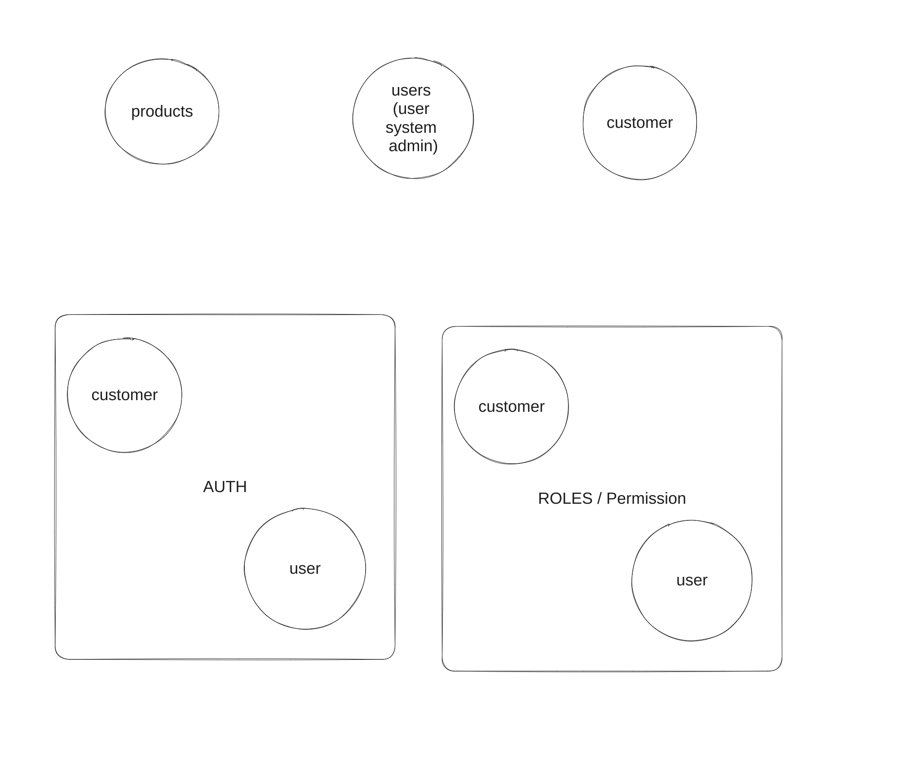

# App backend con sistema de roles y permisso de acceso   NodeJS Typescript Express Clean Architecture

El proyecto es funcional, pero no esta terminado, por lo que se ira actualizando con el tiempo.

Sistema de autenticación con roles de usuario y permisos de acceso. Aplicando NodeJS, Typescript y Express.

Este proyecto se inspira en la metodologia de Clean Architecture, la cual se basa en separar la aplicación en capas, de tal forma que cada capa tenga una responsabilidad única y bien definida.

Si bien no se sigue al pie de la letra la metodologia, se toman los conceptos principales para la estructura del proyecto.

## Base de datos

El proyecto utiliza es agnostico en cuanto a la base de datos, por lo que se puede utilizar cualquier base de datos relacional o no relacional. En este caso se utiliza MongoDB.

Los repositorios se encargan de la comunicación con la base de datos, por lo que si se desea cambiar la base de datos, solo se debe cambiar la implementación de los repositorios.

Path: src/features/{app}/repositories

## Instalación, configuración y ejecución

Antes de ejecutar el proyecto, se debe crear un archivo .env.development en la raiz del proyecto, guiarse del archivo .env.example .

Usar de preferencia [pnpm](https://pnpm.io/) como gestor de paquetes.

```bash
# Instalar dependencias
pnpm install

# Ejecutar en modo desarrollo
pnpm dev

# Ejecutar en modo producción
pnpm start

# Compilar
pnpm build
```

## Estructura de carpetas

```bash
├───src
│   ├───config
│   ├───core
│   ├───enviroments
│   ├───features
│   │   ├───auth
│   │   ├───role
│   │   ├───user
│   │   ├───shared
│   ├───app.ts
│   ├───server.ts
│   ├───routes.ts
```

config: Configuraciones de la aplicación
core: Archivos esenciales de la aplicación
enviroments: Variables de entorno
features: Modulos de la aplicación
app.ts: Archivo principal de la aplicación
server.ts: Archivo de ejecución de la aplicación
routes.ts: Archivo de rutas de la aplicación

## Estructura de un modulo

```bash
├───auth
│   ├───controllers
│   ├───services
│   ├───repositories
│   ├───interfaces
│   ├───routes
│   ├───schemas
```

Vamos de lo mas externo a lo mas interno.

routes: Define la ruta del modulo, aplica los middleware (auth, validate schema, validate permission) y el controlador que se encargara de manejar la petición.

controllers: Se encarga de manejar la petición, en este caso se encarga de llamar al servicio correspondiente.

services: Se encarga de la lógica de negocio, en este caso es el unico que se comunica con los repositorios correspondientes.

repositories: Se encarga de la comunicación con la base de datos.

interfaces: Define las interfaces que se utilizan en el modulo.

schemas: Define los esquemas de validación de los datos, usado actualmente para los input que recibe cada endpoint.




## Configuración de la aplicación

- Establecer las variables de entorno en el archivo .env.development

- Configurar los roles y permisos en el archivo src/config/roles.ts

## Lista de dependencias

- [express](https://www.npmjs.com/package/express) - Framework para NodeJS
- [cors](https://www.npmjs.com/package/cors) - Middleware para habilitar CORS
- [bcryptjs](https://www.npmjs.com/package/bcryptjs) - Encriptador de contraseñas
- [zod](https://www.npmjs.com/package/zod) - Validador de esquemas
- [cookie-parser](https://www.npmjs.com/package/cookie-parser) - Parseador de cookies
- [helmet](https://www.npmjs.com/package/helmet) - Middleware para seguridad
- [jsonwebtoken](https://www.npmjs.com/package/jsonwebtoken) - Generador de tokens
- [mongoose](https://www.npmjs.com/package/mongoose) - ORM para MongoDB

## Contributing

Pull requests son bienvenidas. Para cambios importantes, por favor abra un issue primero para discutir lo que le gustaría cambiar.
